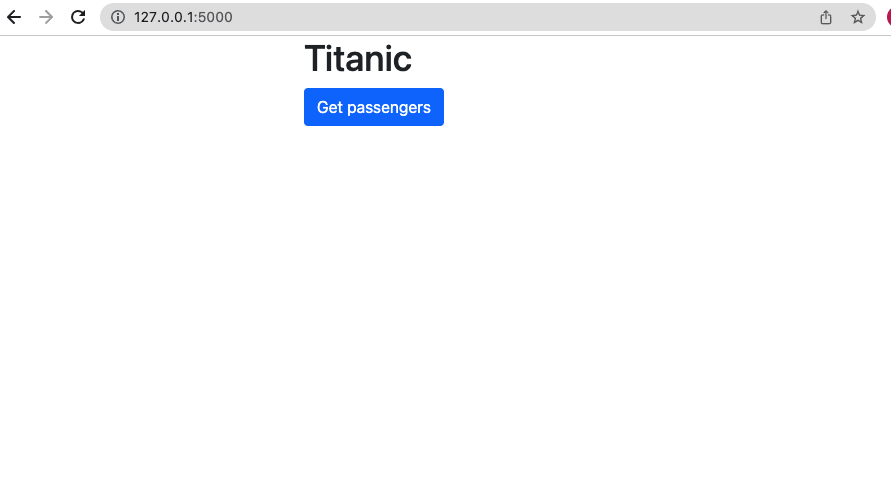
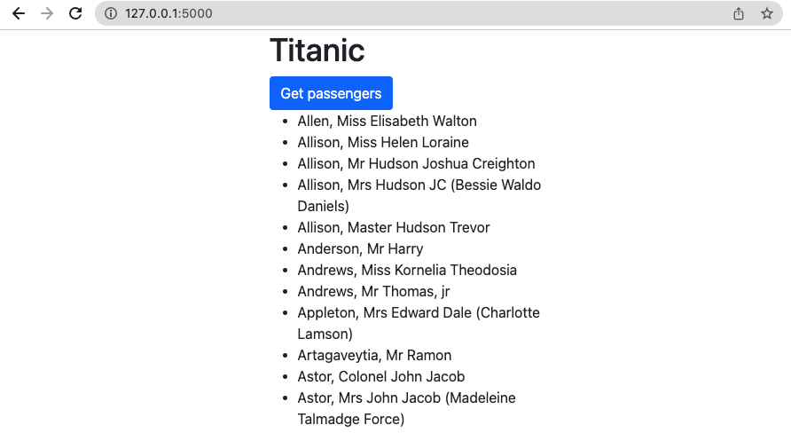
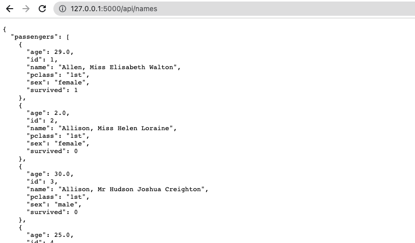
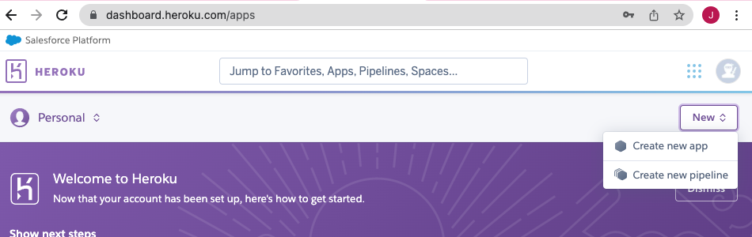
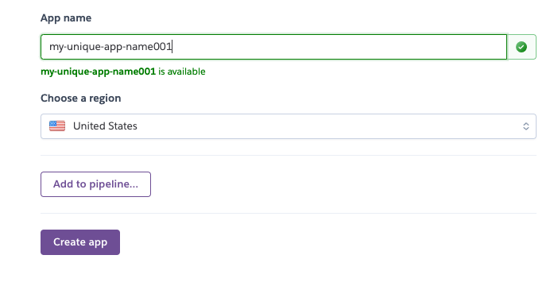
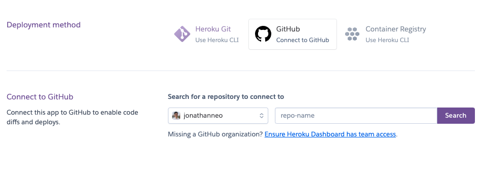
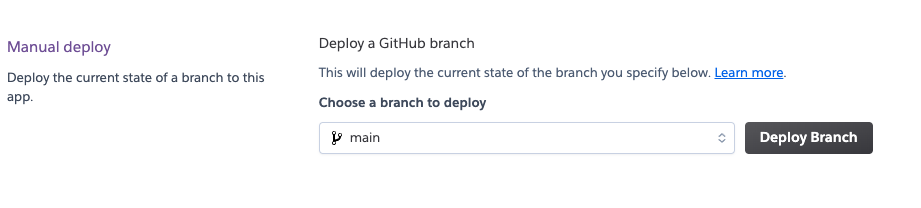
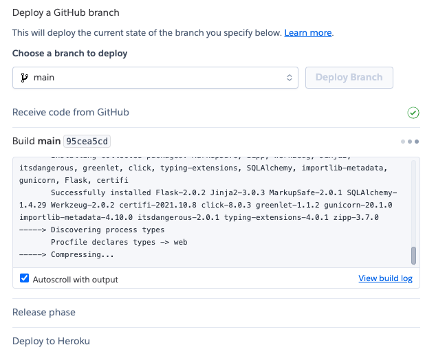
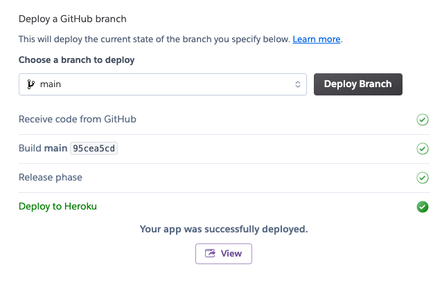
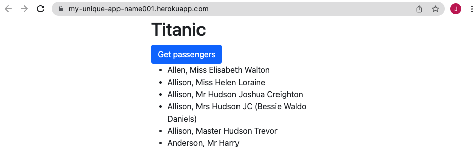

# flask-app-demo

# Tutorial: deploying your flask app to heroku 

- [1. Create and clone your repo](#create-repo)
- [2. Create your conda environment](#create-conda-environment)
- [3. Install python dependencies](#install-python-dependencies)
- [4. Create application](#create-application)
- [5. Deploy application](#deploy-application)

## Create repo

Create a new github repository to store your code. 

Clone the new repo to your computer by doing: 

```
git clone <repo_url>
```

## Create conda environment

Before you start building your flask application, you should first create your conda environment. 

You can do so by executing: 

```
conda create -n <name_of_env> python=3.7
```

The command above creates a new conda environment with your specified name, and sets the python version to 3.7. 

## Install python dependencies 

Now that you have created your conda environment, you should install libraries that you are going to be using for this application.

Run the following lines to install each library.

```
pip install flask           # flask is used for the application server 
pip install sqlalchemy      # sqlalchemy is used to interact with the database 
pip install gunicorn        # gunicorn is used to handle server requests 
```

## Create application

Now you can create your application. 

Refer to the diagram below and create the empty files and folders accordingly. This is a generic flask application directory pattern. 

```
titanic.sqlite              # a pre-seeded database
app.py                      # the main python app 
|__ templates               # folder to store all html files 
    |__ index.html          # the main html file 
|__ static                  # folder to store any static files such as js, css, images 
    |__ js                  # folder to store all js files 
        |__ app.js          # the main js file 
    |__ css                 # folder to store all css files 
        |__ styles.css      # main css file for custom styles 
```

After creating the empty files and folders, you can copy and paste code into each file. 

### app.py

```python
from flask import Flask, render_template
from sqlalchemy import create_engine

# database setup 
engine = create_engine("sqlite:///titanic.sqlite")

# flask app setup
app = Flask(__name__)

@app.route("/")
def index():
    return render_template("index.html")

@app.route("/api/names")
def names():
    results = [
        {
            "id": list(row)[0],
            "name": list(row)[1],
            "pclass": list(row)[2],
            "age": list(row)[3],
            "sex": list(row)[4],
            "survived": list(row)[5],
        } for row in engine.execute("select * from passenger").all()]

    return {"passengers":results}

if __name__ == '__main__':
    app.run(debug=True)
```

### templates/index.html

Note: Flask looks specifically for the `templates` folder. So make sure to name the html folder as `templates`.

```html
<html>
    <head>
        <title>Sample app</title>
        <!-- boostrap css -->
        <link href="https://cdn.jsdelivr.net/npm/bootstrap@5.1.3/dist/css/bootstrap.min.css" rel="stylesheet" integrity="sha384-1BmE4kWBq78iYhFldvKuhfTAU6auU8tT94WrHftjDbrCEXSU1oBoqyl2QvZ6jIW3" crossorigin="anonymous">
    </head>
    <body>
        <div class="container">
            <div class="row">
                <div class="col-3">

                </div>
                <div class="col-6">
                    <h1>Titanic</h1>
                    <button id="get_passengers" type="button" class="btn btn-primary">Get passengers</button>
                    <ul id="passenger_list"></ul>
                </div>
                
                <div class="col-3"></div>
            </div>
        </div>
        <!-- boostrap javascript -->
        <script src="https://cdn.jsdelivr.net/npm/bootstrap@5.1.3/dist/js/bootstrap.bundle.min.js" integrity="sha384-ka7Sk0Gln4gmtz2MlQnikT1wXgYsOg+OMhuP+IlRH9sENBO0LRn5q+8nbTov4+1p" crossorigin="anonymous"></script>

        <!-- d3 javascript -->
        <script src="https://d3js.org/d3.v7.min.js"></script>

        <!-- custom javascript -->
        <script src="../static/js/app.js"></script>
    </body>
</html>
```

### static/js/app.js

```javascript
d3.select("#get_passengers").on("click", ()=>{
    d3.json("/api/names").then(data => {
        data.passengers.forEach(row =>{
            d3.select("#passenger_list").append("li").text(row.name)
        })
    })
})
```

### static/css/styles.css

We don't have any custom styles, so for now just put in the comment below. 

```css
/* add custom styles here */
```

## Run application

Now that you have created your application, you may run it locally to verify that it works. 

Run your application by executing: 

```
python app.py
```

You should see the following appear in your command line: 
```
* Serving Flask app 'app' (lazy loading)
 * Environment: production
   WARNING: This is a development server. Do not use it in a production deployment.
   Use a production WSGI server instead.
 * Debug mode: on
 * Running on http://127.0.0.1:5000/ (Press CTRL+C to quit)
 * Restarting with stat
 * Debugger is active!
```

Now, go to the URL specified in the message "Running on '__URL__'". 

You should see the following: 




Click on "Get passengers" to test your application to see if the javascript calls work. You should see the following: 




There is also an API which you can access by appending `/api/names` to your URL. You should see: 




Great, your app works! 

## Deploy application 

To deploy your application, you will need to use a web hosting service. 

A popular and easy to use one is [Heroku](https://www.heroku.com/). 

You will need to go to https://www.heroku.com/ to sign up and create an account. 

To deploy your application to Heroku, follow the steps below. 

### Push your code to github 

Push your code to github. Heroku will deploy the code which is in your repo. 

```
git add . 
git commit -m "commit message here"
git push 
```

### Freeze pip requirements 

Your application uses the python libraries you've installed above for it to run. 

For Heroku to host the application for you, you will need to provide those dependencies in a `requirements.txt` file. 

To easily do so, run: 

```
pip freeze > requirements.txt 
```

This will store all python dependencies into the `requirements.txt` file. 

In the `requirements.txt` file, you should see something similar to: 

```
certifi==2021.10.8
click==8.0.3
Flask==2.0.2
greenlet==1.1.2
gunicorn==20.1.0
importlib-metadata==4.10.0
itsdangerous==2.0.1
Jinja2==3.0.3
MarkupSafe==2.0.1
SQLAlchemy==1.4.29
typing_extensions==4.0.1
Werkzeug==2.0.2
zipp==3.7.0

```

### Add the procfile

Heroku needs a `Procfile` to tell Heroku how it should launch your app. 

So create a new file called `Procfile` (match case and letters), and place the following code into your procfile. 

```
web: gunicorn app:app
```

The code above will tell Heroku to launch a web server using gunicorn, and that your app is located in 'app' which refers to `app.py`. 

You are now ready to deploy your application. The next step below will step through the deployment. 

### Deploy to Heroku 

1. Go to your heroku account and select `New` > `Create new app`
    

2. Provide a unique app name and click on `create app`
    

3. Change the deployment method to "GitHub" and enter your repo-name to connect to your github repo 
    

4. Scroll to the bottom in the "Manual deploy" section and select the `main` branch and click `Deploy Branch` 
    

5. Allow 1 minute for your application to deploy. You should see the deploy logs execute in the meantime. 
    

6. Your app has deployed successfully! You should see a URL for your hosted application. 
    

7. Congrats, you have successfully created and deployed a Flask application on Heroku! 
    


